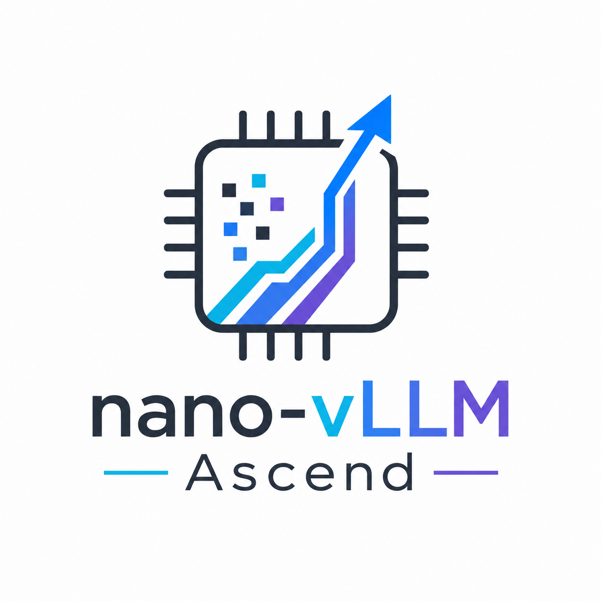

<p align="center"> 
 
</p>

# nano-vLLM Ascend

Experimental Ascend NPU adaptation of [nano-vLLM](https://github.com/GeeeekExplorer/nano-vllm).

This repository is a research-oriented fork of nano-vLLM, focusing on adapting a minimal and readable vLLM-style inference engine to Huawei Ascend NPUs. The goal is to study LLM inference system components such as request scheduling, KV cache management, model execution, and backend abstraction on Ascend hardware.

> Status: Work in progress. This project is currently experimental and not production-ready.

## Overview

nano-vLLM is a lightweight implementation of a vLLM-style inference engine. This fork keeps the original project's minimal and readable design while exploring Ascend NPU support.

The main focus areas include:

* Ascend NPU backend adaptation
* Compatibility with `torch-npu` and the Ascend software stack
* vLLM-style request scheduling
* KV cache management on NPU devices
* Model execution and sampling path verification
* Benchmarking and performance analysis on Ascend hardware

## Goals

This project aims to:

* Port nano-vLLM execution flow to Ascend NPUs
* Identify CUDA-specific assumptions in the original implementation
* Introduce backend abstraction where necessary
* Verify basic LLM inference on Ascend hardware
* Document compatibility issues, unsupported operators, and fallback paths
* Provide a readable codebase for studying LLM inference systems on NPUs

## Current Status

The project is under active development.

* [ ] Ascend environment setup documentation
* [ ] Basic `torch-npu` device initialization
* [ ] Model loading compatibility check
* [ ] Prefill execution on Ascend NPU
* [ ] Decode execution on Ascend NPU
* [ ] KV cache allocation and update on NPU
* [ ] Sampling path verification
* [ ] End-to-end generation test
* [ ] Ascend benchmark scripts
* [ ] Performance comparison with CPU / CUDA baselines

## Installation

Clone this repository:

```bash
git clone https://github.com/YOUR_NAME/nano-vllm-ascend.git
cd nano-vllm-ascend
```

Install the package in editable mode:

```bash
pip install -e .
```

Ascend-specific dependencies depend on your hardware, driver, CANN, and `torch-npu` environment. Detailed setup instructions will be added as the adaptation progresses.

## Model Download

For local testing, you may download a small model such as Qwen3-0.6B:

```bash
huggingface-cli download --resume-download Qwen/Qwen3-0.6B \
  --local-dir ~/huggingface/Qwen3-0.6B/ \
  --local-dir-use-symlinks False
```

You may also use other Hugging Face-compatible causal language models, depending on operator support and memory capacity.

## Quick Start

The original nano-vLLM API is expected to be preserved where possible:

```python
from nanovllm import LLM, SamplingParams

llm = LLM(
    "/YOUR/MODEL/PATH",
    enforce_eager=True,
    tensor_parallel_size=1,
)

sampling_params = SamplingParams(
    temperature=0.6,
    max_tokens=256,
)

prompts = ["Hello, nano-vLLM Ascend."]
outputs = llm.generate(prompts, sampling_params)

print(outputs[0]["text"])
```

> Note: Ascend execution support is still being implemented. Some code paths may currently rely on the original CUDA-oriented implementation.

## Ascend Adaptation Notes

The adaptation work mainly involves the following parts:

### Device Management

The original implementation may assume CUDA devices in some execution paths. This fork aims to replace CUDA-specific assumptions with device-agnostic or Ascend-compatible logic.

### Operator Compatibility

Some PyTorch operators or fused CUDA kernels may not be directly available on Ascend NPUs. These parts need to be checked and replaced with compatible implementations when necessary.

### KV Cache

KV cache allocation, layout, update, and reuse are central to efficient LLM inference. This project will verify whether the original KV cache design can be reused on Ascend or needs backend-specific modifications.

### Scheduling

The project keeps the vLLM-style scheduling design of nano-vLLM and studies how request batching, prefill, and decode execution behave on Ascend hardware.

## Benchmark

No Ascend benchmark result is reported yet.

Future benchmarks may include:

* Time to First Token, TTFT
* Time per Output Token, TPOT
* Output throughput
* End-to-end latency
* NPU memory usage
* Batch size scalability
* Comparison with CPU and CUDA baselines

All benchmark results should include hardware, software stack, model, input length, output length, batch size, and measurement method.

## Roadmap

* [ ] Run original nano-vLLM test cases
* [ ] Locate CUDA-specific code paths
* [ ] Add Ascend device detection
* [ ] Add basic `torch-npu` execution support
* [ ] Verify single-request generation
* [ ] Verify batched generation
* [ ] Analyze KV cache behavior on Ascend
* [ ] Add Ascend-specific benchmark script
* [ ] Document common errors and fixes
* [ ] Refactor backend-specific logic into a cleaner abstraction

## 中文说明

本仓库是 [nano-vLLM](https://github.com/GeeeekExplorer/nano-vllm) 的 Ascend NPU 实验性适配版本。

项目目标是在保持原项目轻量、可读设计的基础上，探索 vLLM 风格的 LLM 推理系统如何适配到华为 Ascend NPU。重点关注请求调度、KV Cache 管理、模型执行、采样流程和 NPU 后端适配。

当前项目仍处于开发阶段，尚不是生产可用的推理引擎。

## Upstream

This repository is forked from [GeeeekExplorer/nano-vllm](https://github.com/GeeeekExplorer/nano-vllm).

nano-vLLM is a lightweight vLLM implementation built from scratch. This fork follows the original project's readable and minimal design philosophy while exploring Ascend NPU adaptation.

## License

This project follows the license of the upstream nano-vLLM project. See [LICENSE](./LICENSE) for details.
